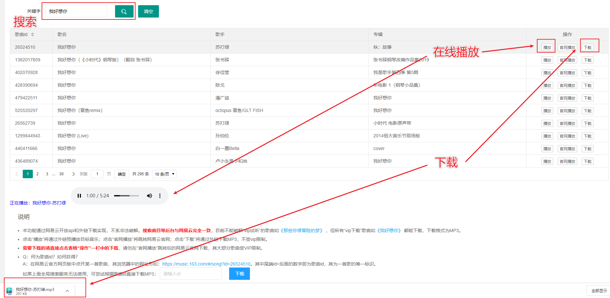

# 网易云音乐免费下载MP3，免VIP

本项目针对2020年最新的网易云后台，对所有“vip下载”歌曲如<a href="https://music.163.com/#/song?id=26524510" target="_blank">《我好想你》</a> 都能免vip下载，下载格式为MP3；尚不能破解“vip试听”的歌曲如<a href="https://music.163.com/#/song?id=108138" target="_blank">《那些你很冒险的梦》</a>。

## 项目更新历史

* 2020年5月18日，初次上传。
* 2020年5月25日，后台第三方搜索api添加一个备选方案，应对首选api服务无法使用的情况。

## 在线演示

网址：<a href="https://loveyou.kurochan.top/fake/music163_download" target="_blank">https://loveyou.kurochan.top/fake/music163_download</a>

初次进入需授权码：miku_love_you_1314

点击进入置顶资源“网易云音乐免费下载MP3，免VIP”：



## 项目结构

```
├─src
│  ├─main
│  │  ├─java
│  │  │  └─com
│  │  │      └─jzy
│  │  │          ├─demo    //使用示例
│  │  │          ├─model   //模型类
│  │  │          └─util    //核心工具类
│  │  └─resources
│  └─test
│      └─java
```

## 环境

- jdk1.8
- maven3.x

## 使用说明

本项目的代码不是在线演示网页端的完整项目代码，但含其后台所有核心工具方法的封装，供参考调用。

* idea中直接导入本maven项目即可完成初始构建。
* 在`com.jzy.demo`包下有使用示例，可直接运行。
* 所有核心方法都在`com.jzy.util.Music163Utils`工具类中。